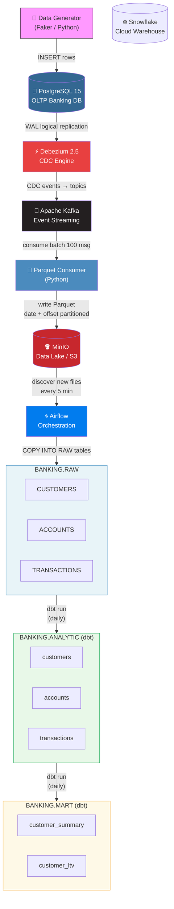

# Transaction Streaming Pipeline

A production-grade, real-time streaming data pipeline for banking transactions. The pipeline captures every database change from PostgreSQL using CDC (Change Data Capture), streams events through Kafka, stores them as Parquet files in a data lake (MinIO), and loads them into Snowflake for analytics — with dbt handling multi-layer transformations and Airflow orchestrating the batch loads.

---

## Architecture



---

## Tech Stack

| Category | Technology | Version | Purpose |
|---|---|---|---|
| Source Database | PostgreSQL | 15 | OLTP banking database with logical replication |
| CDC | Debezium | 2.5 | Captures row-level changes via PostgreSQL WAL |
| Message Streaming | Apache Kafka | 7.4.1 | Durable, distributed event streaming |
| Message Coordination | Zookeeper | 7.4.0 | Kafka cluster coordination |
| Data Lake | MinIO | latest | S3-compatible object storage for Parquet files |
| Data Warehouse | Snowflake | — | Cloud analytics warehouse |
| Transformation | dbt | 1.0+ | Multi-layer SQL transformations with testing |
| Orchestration | Apache Airflow | — | DAG scheduling and monitoring |
| Infrastructure as Code | Terraform | 0.100.0 | Snowflake infrastructure provisioning |
| Schema Migration | Flyway | 9 | Versioned PostgreSQL schema management |
| Containerization | Docker + Compose | — | Reproducible local development stack |
| Language | Python | 3.x | Data generation, CDC init, Parquet consumer |

---

## Prerequisites

- [Docker](https://www.docker.com/get-started) and Docker Compose
- [Terraform](https://developer.hashicorp.com/terraform/install) CLI
- A [Snowflake](https://www.snowflake.com/) account with ACCOUNTADMIN or SYSADMIN access
- Git

---

## Project Structure

```
Project-Transaction-Streaming-Pipline/
├── airflow/                    # Airflow DAGs and Dockerfile
│   ├── dags/
│   │   ├── dag_dbt.py          # Runs dbt models daily
│   │   ├── dag_s3_to_snowflake.py  # Loads new Parquet files from MinIO every 5 min
│   │   └── config.py           # Table list config
│   └── dockerfile-airflow.dockerfile
├── dbt/                        # dbt project for Snowflake transformations
│   ├── models/
│   │   ├── raw/                # Source definitions (BANKING.RAW)
│   │   ├── analytic/           # Cleaned, typed, deduplicated tables
│   │   └── marts/              # Business-ready aggregation views
│   ├── dbt_project.yml
│   └── profiles.yml
├── data-generator/             # Synthetic banking data generator (Faker)
├── parquet-consumer/           # Kafka consumer → Parquet writer → MinIO
├── debezium-init/              # Registers PostgreSQL CDC connector via REST API
├── flyway/                     # Versioned SQL migrations for PostgreSQL
│   └── sql/
│       ├── V1__create_customers.sql
│       ├── V2__create_accounts.sql
│       ├── V3__create_transactions.sql
│       └── V4__add_transaction_indexes.sql
├── terraform/                  # Snowflake infrastructure (database, schemas, roles)
├── common/                     # Shared Python utilities (logging)
└── docker-compose.yml          # Full stack orchestration
```

---

## Getting Started

### 1. Clone the Repository

```bash
git clone <repo-url>
cd Project-Transaction-Streaming-Pipline
```

### 2. Configure Environment Variables

Create a `.env` file in the project root with the following variables:

```env
# PostgreSQL (Banking)
POSTGRES_USER=banking_user
POSTGRES_PASSWORD=your_password
POSTGRES_DB=banking
POSTGRES_HOST=postgres
POSTGRES_PORT=5432

# Debezium retry settings
RETRY_INTERVAL=5
RETRY_MAX=10

# MinIO
MINIO_ROOT_USER=minioadmin
MINIO_ROOT_PASSWORD=your_minio_password

# Airflow
AIRFLOW_FERNET_KEY=your_fernet_key
AIRFLOW_DB_USER=airflow
AIRFLOW_DB_PASSWORD=airflow
AIRFLOW_DB_NAME=airflow

# Snowflake
SNOWFLAKE_ACCOUNT=your_account.region
SNOWFLAKE_DBT_USER=dbt_user
SNOWFLAKE_DBT_PASSWORD=your_snowflake_password
SNOWFLAKE_DBT_ROLE=TRANSFORMER
SNOWFLAKE_WAREHOUSE=COMPUTE_WH

# Kafka
KAFKA_BOOTSTRAP_SERVERS=kafka:9092
```

> Generate a Fernet key with: `python -c "from cryptography.fernet import Fernet; print(Fernet.generate_key().decode())"`

### 3. Provision Snowflake Infrastructure (Terraform)

```bash
cd terraform
terraform init
terraform plan
terraform apply
cd ..
```

This creates the `BANKING` database, `RAW` / `ANALYTIC` / `MART` schemas, roles, users, and the compute warehouse.

### 4. Start All Services

```bash
docker compose up -d
```

To also generate sample data:

```bash
docker compose --profile datagen up -d
```

### 5. Verify Services

- Airflow UI: [http://localhost:8080](http://localhost:8080) (user: `airflow` / pass: `airflow`)
- MinIO Console: [http://localhost:9001](http://localhost:9001)
- Debezium API: [http://localhost:8083](http://localhost:8083)

---

## Services & Ports

| Service | Container | Port(s) | UI / Notes |
|---|---|---|---|
| PostgreSQL (Banking) | `transactions-postgres` | `5432` | Source OLTP database |
| Zookeeper | `zookeeper` | `2181` | Kafka coordination |
| Kafka | `kafka` | `9092` (internal), `29092` (host) | Broker |
| Debezium Connect | `debezium-connect` | `8083` | REST API for connectors |
| MinIO | `minio` | `9000` (API), `9001` (console) | S3-compatible data lake |
| Airflow Webserver | `airflow-webserver` | `8080` | DAG management UI |
| Airflow Postgres | `airflow-postgres` | `5433` | Airflow metadata DB |
| Parquet Consumer | `parquet-consumer` | — | Kafka → MinIO writer |
| Data Generator | `datagen` | — | Profile: `datagen` |

---

## Data Flow Details

| Stage | Component | Description |
|---|---|---|
| 1. Generate | `data-generator` | Creates synthetic customers, accounts, and transactions in PostgreSQL using Faker |
| 2. Capture | Debezium | Reads PostgreSQL WAL (Write-Ahead Log) and publishes row changes to Kafka topics |
| 3. Stream | Kafka | Maintains three topics: `banking_server.public.customers`, `banking_server.public.accounts`, `banking_server.public.transactions` |
| 4. Consume | `parquet-consumer` | Reads Kafka messages in batches of 100, serializes to Parquet format |
| 5. Store | MinIO | Parquet files written to `raw/{table}/date={YYYY-MM-DD}/offset={offset}.parquet` — idempotent by offset |
| 6. Discover | Airflow (`dag_s3_to_snowflake`) | Every 5 minutes, scans MinIO for new Parquet files using a watermark timestamp |
| 7. Load | Snowflake RAW | Parquet files loaded into `BANKING.RAW.*` tables as `VARIANT` JSON with file metadata |
| 8. Transform | dbt (`dag_dbt`) | Daily run extracts typed columns from VARIANT, deduplicates, and builds mart views |

---

## dbt Models

The dbt project (`snowflake_banking`) follows a 3-layer architecture:

### Raw Layer — `BANKING.RAW`
Source definitions only. Tables contain raw `VARIANT` JSON columns plus metadata (`_filename`, `_loaded_at`). Provisioned by Terraform and loaded by Airflow.

### Analytic Layer — `BANKING.ANALYTIC`

| Model | Description |
|---|---|
| `customers.sql` | Extracts typed customer fields from VARIANT |
| `accounts.sql` | Extracts account data with customer FK |
| `transactions.sql` | Extracts transaction data with deduplication via `ROW_NUMBER()` |

### Mart Layer — `BANKING.MART`

| Model | Description |
|---|---|
| `customer_summary.sql` | Aggregates total accounts and balance per customer |
| `customer_ltv.sql` | Calculates customer lifetime value (total transactions, amounts, first/last transaction dates) |

Run dbt manually:

```bash
cd dbt
dbt run
dbt test
```

---

## Airflow DAGs

| DAG | Schedule | Description |
|---|---|---|
| `dag_s3_to_snowflake` | Every 5 minutes | Scans MinIO `raw/` bucket for new Parquet files and loads them into Snowflake RAW tables |
| `dag_dbt` | Daily | Runs dbt models (`dbt run`) and then dbt tests (`dbt test`) against Snowflake |

---

## Snowflake Schema

```
BANKING (database)
├── RAW (schema)
│   ├── CUSTOMERS          — raw VARIANT data from CDC
│   ├── ACCOUNTS           — raw VARIANT data from CDC
│   └── TRANSACTIONS       — raw VARIANT data from CDC
├── ANALYTIC (schema)
│   ├── CUSTOMERS          — typed, cleaned customer records
│   ├── ACCOUNTS           — typed, cleaned account records
│   └── TRANSACTIONS       — deduplicated transaction records
└── MART (schema)
    ├── CUSTOMER_SUMMARY   — accounts count and total balance per customer
    └── CUSTOMER_LTV       — customer lifetime value metrics
```

Roles and warehouse are managed by Terraform:

- `TRANSFORMER` role — used by dbt for read/write access to ANALYTIC and MART
- `LOADER` role — used by Airflow for write access to RAW
- `COMPUTE_WH` warehouse — shared compute for all workloads
